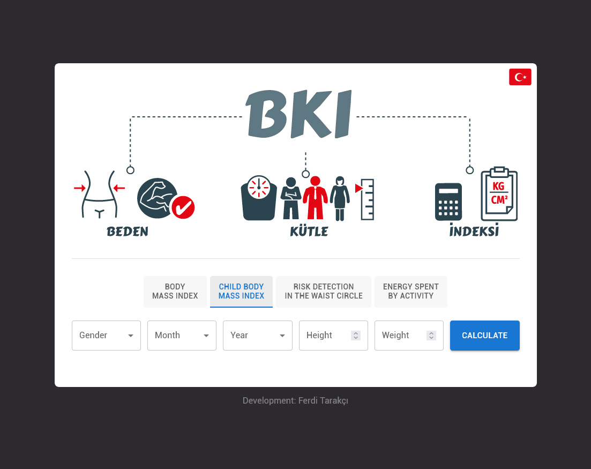
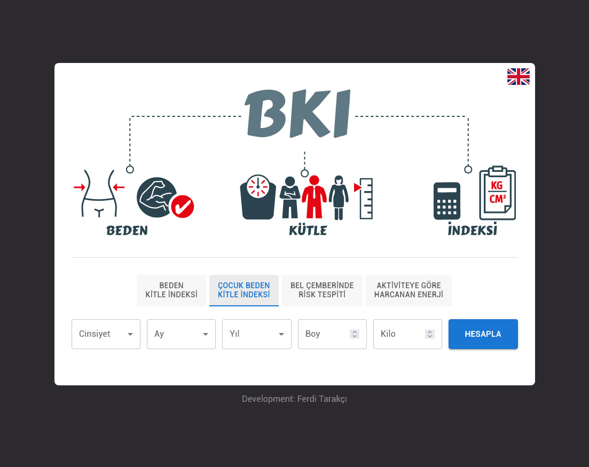

# Body Mass Index Calculator (BMI)

## Application Description
This application has been prepared using React.js with Turkish and English language options. Application; It provides body mass index, waist circumference risk determination and calculation of calories expended according to activity.

## Uygulama Tanımı (TR)
Bu uygulama, Türkçe ve İngilizce dil seçenekleri ile React.js kullanılarak hazırlanmıştır. Uygulama; vücut kitle indeksi, bel çevresi risk tespiti ve aktiviteye göre harcanan kalorilerin hesaplanmasını sağlar.

## Deployment
This project is automatically imported into the production environment with Vercel.

Bu proje Vercel ile otomatik olarak üretim ortamına aktarılır. (TR)
<br><br>

https://bmi.ferditarakci.com.tr

<br>

## Project setup
```
yarn
```

### Compiles and hot-reloads for development
```
yarn dev
```

### Compiles and minifies for production
```
yarn build
```

This template provides a minimal setup to get React working in Vite with HMR and some ESLint rules.

Currently, two official plugins are available:

- [@vitejs/plugin-react](https://github.com/vitejs/vite-plugin-react/blob/main/packages/plugin-react) uses [Babel](https://babeljs.io/) for Fast Refresh
- [@vitejs/plugin-react-swc](https://github.com/vitejs/vite-plugin-react/blob/main/packages/plugin-react-swc) uses [SWC](https://swc.rs/) for Fast Refresh

## Expanding the ESLint configuration

If you are developing a production application, we recommend using TypeScript with type-aware lint rules enabled. Check out the [TS template](https://github.com/vitejs/vite/tree/main/packages/create-vite/template-react-ts) for information on how to integrate TypeScript and [`typescript-eslint`](https://typescript-eslint.io) in your project.

## Screenshot
<br>
<br><br>